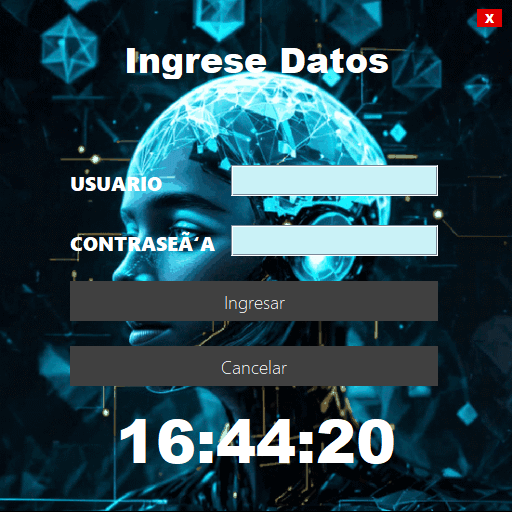
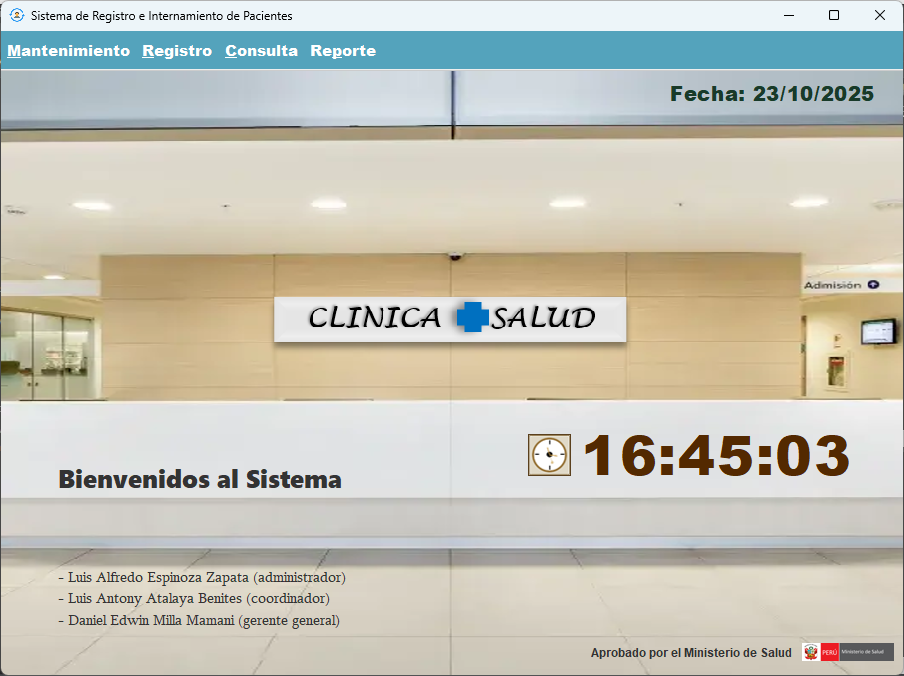
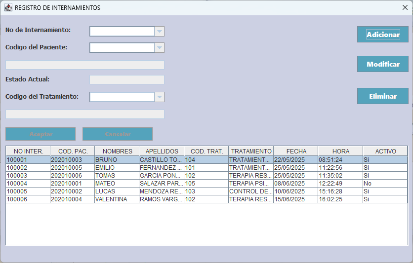
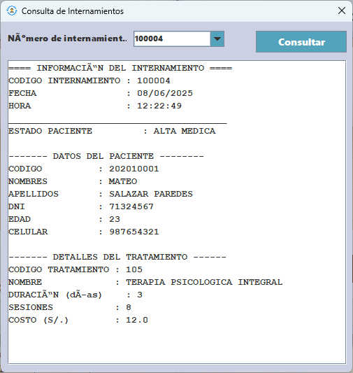
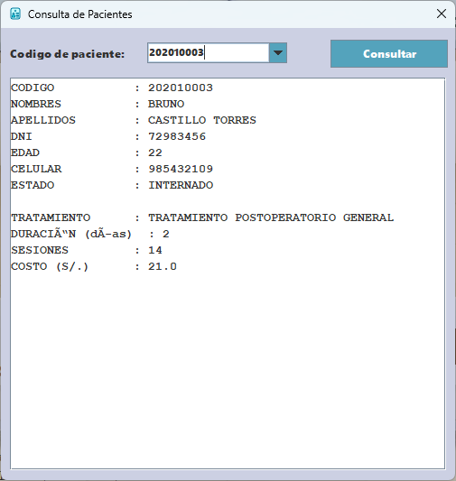
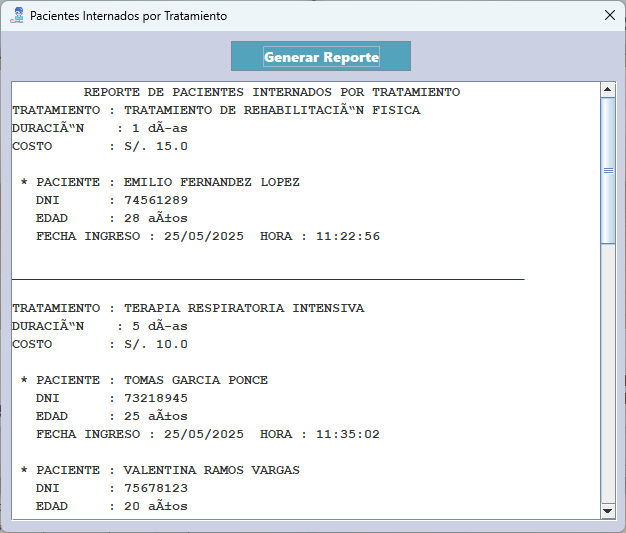

# 🏥 Clínica +Salud

### Sistema de Registro e Internamiento de Pacientes

Proyecto académico desarrollado en **Java** (CIBERTEC – 2025) para automatizar la gestión clínica y digitalizar procesos de registro, internamiento, tratamiento y alta médica.

## 🚀 Características Principales

* 🧾 **Registro de pacientes** con datos personales y clínicos.
* 🏥 **Internamiento de pacientes** con asignación de tratamientos y control de estado.
* 💊 **Gestión de tratamientos**: duración, sesiones y costos.
* ✅ **Altas médicas** automáticas con actualización del historial del paciente.
* 📊 **Reportes y consultas**: pacientes internados, dados de alta o por tratamiento.
* 💾 **Persistencia de datos** mediante archivos `.txt`.
* 🧠 **Estructuras de datos** (ArrayList) para almacenamiento dinámico.
* 🖥️ **Interfaz gráfica** intuitiva desarrollada con **Java Swing**.
* 🔒 **Integridad de información** con validaciones y respaldo local.
* 📈 **Optimización de tiempos administrativos** reduciendo errores y duplicidades.

## 📦 Instalación

```bash
# Clonar el repositorio
git clone https://github.com/luisespinozazapata/clinicaMasSalud
cd clinicaMasSalud
# Importar a Eclipse IDE
Moverse a src/gui/
# Inicia la aplicación:
Ejecutar LoginAcceso.java
# Ingresar credenciales:
usuario: luisEspinoza 
contraseña 970163
```
⭐ ¡Si te gusta el proyecto, déjale una estrella en GitHub!

## 📸 Capturas del Sistema
### Login

### Inicio

### Mantenimiento de Pacientes

### Registro de internamientos

### Consulta de internamientos

### Consulta de Pacientes

### Reporte de Pacientes internados por tratamiento


